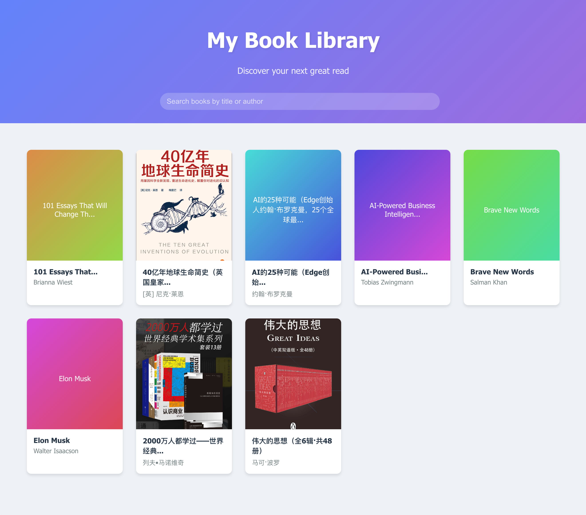

# AI Book Library

This is a system for managing and reading epub books locally, optimized for mobile devices. I will update the README with more information later.



## Installation and Startup

1. Clone the project to your local machine:
   ```
   git clone https://github.com/douxin/ai-book-library.git
   ```

2. Navigate to the project directory:
   ```
   cd ai-book-library
   ```

3. Install dependencies:
   ```
   npm install
   ```

4. Start the development server:
   ```
   npm run start
   ```

5. Open [http://localhost:3000](http://localhost:3000) in your browser to view the application.

## Book Management

### Adding Books
Place books in the `public/books` folder. Currently, only epub format is supported.

### Extracting Book Information
Run `npm run extract-books` to extract book information and save it to `src/data/books.json`. The system will read book information from this JSON file.

After extraction is complete, refresh the page to use the system.